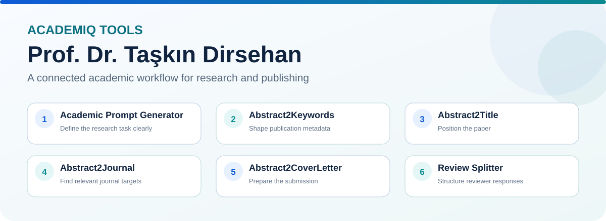

  

# Prof. Dr. Taşkın Dirsehan

Professor of Marketing | AcademIQ Tools | Research Methods | Consumer Behaviour | AI for Research and Publishing

AcademIQ Tools brings together six focused academic web applications supporting the research-to-publication journey from framing the academic task to reviewer response.

## AcademIQ Tools

Main portal: https://tdirsehan.github.io/academic-ai-toolkit/

| Stage | Tool | What it does | Live App | Repository |
|---|---|---|---|---|
| 1. Research planning | Academic Prompt Generator | Builds structured academic AI prompts with evidence rules, constraints, output formats, and quality controls. | [Open App](https://tdirsehan.github.io/academic-prompt-generator/) | [GitHub](https://github.com/tdirsehan/academic-prompt-generator) |
| 2. Research communication | Abstract2Keywords | Generates publication-oriented keywords and supports structured academic abstracts. | [Open App](https://tdirsehan.github.io/abstract2keywords/) | [GitHub](https://github.com/tdirsehan/abstract2keywords) |
| 3. Positioning | Abstract2Title | Generates and compares publication-ready title alternatives. | [Open App](https://tdirsehan.github.io/abstract2title/) | [GitHub](https://github.com/tdirsehan/abstract2title) |
| 4. Dissemination | Abstract2Journal | Matches abstracts with journals using publication evidence, topic overlap, similar articles, and OpenAlex data. | [Open App](https://tdirsehan.github.io/abstract2journal/) | [GitHub](https://github.com/tdirsehan/abstract2journal) |
| 5. Submission | Abstract2CoverLetter | Drafts journal-oriented cover letters with scope-fit and quality checks. | [Open App](https://tdirsehan.github.io/abstract2coverletter/) | [GitHub](https://github.com/tdirsehan/abstract2coverletter) |
| 6. Revision | Review Splitter | Converts reviewer reports into structured point-by-point response items such as R1.1, R1.2, and R2.1. | [Open App](https://tdirsehan.github.io/review-splitter/) | [GitHub](https://github.com/tdirsehan/review-splitter) |

## One Connected Research Workflow

`Research task / Prompt` → `Keywords` → `Title` → `Journal` → `Cover Letter` → `Reviewer Response`

The six modules can be used independently, while AcademIQ Tools provides a single entry point across the research-to-publication process.

## Research Interests

- Consumer behaviour
- Marketing research
- Technology acceptance and adoption
- Human-computer interaction
- Artificial intelligence in marketing
- Academic writing and publishing support
- Research design and quantitative methods

## Responsible Use

AcademIQ Tools supports academic work but does not replace scholarly judgement, peer review, editorial decisions, source verification, or institutional research governance. Scores and recommendations produced by individual tools should be treated as decision-support indicators rather than guarantees of publication or acceptance.

## GitHub

Profile: https://github.com/tdirsehan